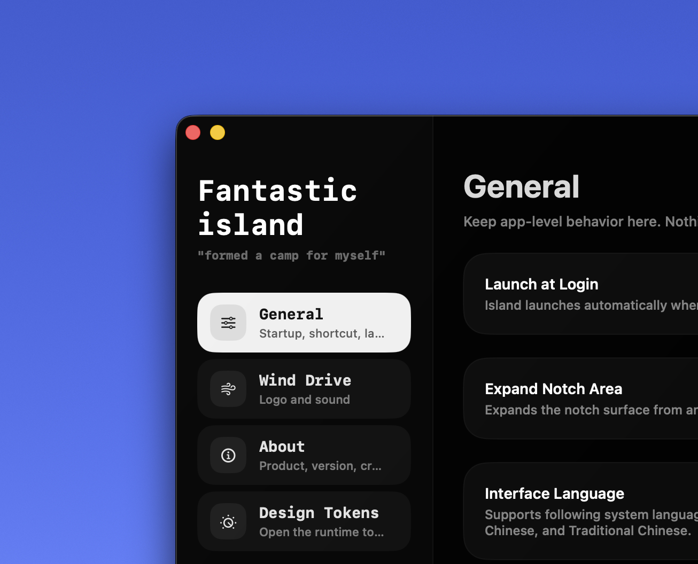
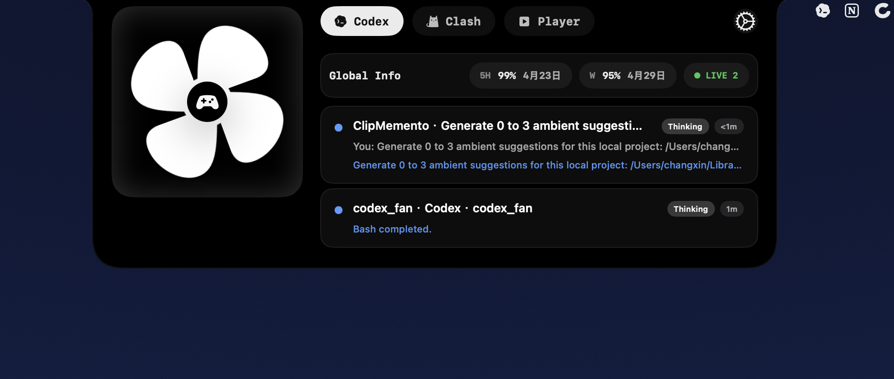
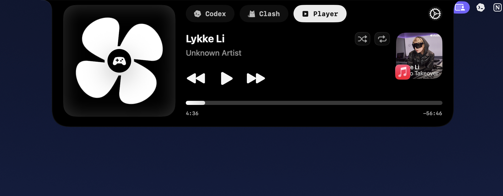

# Fantastic Island

[English](./README.md) | [简体中文](./README.zh-CN.md)

Fantastic Island is built on top of the open-source project `open-vibe-island`, and is an open, extensible app for the macOS notch area.

It supports plugging different capabilities in as modules, and the code is open too. In theory, you can use this container and its extensibility to build an island that is actually yours.

The repository currently ships with eight built-in modules:

- `Agents`
- `Player`
- `Horizon`
- `Timer`
- `Shelf`
- `System`
- `Diagnostics`
- `X Post`

The app keeps the open-vibe-island notch interaction as a foundation, while the product surface is now a native, provider-aware island rather than a collection of detached demos.

## Core Idea

More and more products want to live around the island area, but that space is scarce. If you use A, you usually cannot use B without the interactions starting to fight each other.

Fantastic Island started from the open-source project `open-vibe-island`, but the real thing I want to build is a shell architecture with modular extensions, so you can assemble your own island as needed. You could even plug a todo module into it, although I am not totally sure the experience would be good.

## Settings And Modularity

<p align="center">
  
</p>
<p align="center">
  
</p>

The settings page keeps app-level behavior, module toggles, provider setup, and the design token debugging entry in one place. The shell stays stable, while the module layer stays easy to extend.

## Built-In Pieces

| Module / Component | Description |
| --- | --- |
| `Agents` | Pulls local agent workflow state into the island, including Codex, Claude Code, Cursor, Antigravity, and Conductor sessions where supported. |
| `Player` | Follows the current Now Playing source and exposes artwork, progress, visualizer, and transport controls. |
| `Horizon` | Keeps the next event, reminders, weather, and glance context compact. |
| `Timer` | Provides focused timer controls as its own module instead of crowding Horizon. |
| `Shelf` | Holds dropped files with compact open, reveal, share, and remove actions. |
| `System` | Shows battery and hardware status without turning the island into a dashboard. |
| `Diagnostics` | Surfaces provider hook readiness, quota bridge state, app-server status, and repair actions. |
| `X Post` | Drafts and publishes compact text posts with user-provided X OAuth credentials. |

## Module Examples

### Agents

The `Agents` module is more like a local workspace living inside the notch. Session state, quota, recent activity, approvals, questions, transcripts, and safe app handoff stay visible without making you jump back to the terminal every few seconds.



### Player

The `Player` module is here to show and control current playback, so media controls can live together with agents and utilities without needing another separate UI layer.



### Horizon, Timer, Shelf, System, And Diagnostics

Horizon keeps the contextual glance layer small. Timer, Shelf, System, and Diagnostics are separate modules so the island can stay compact while still covering quick utility tasks and agent runtime health.

### X Post

The `X Post` module is a compact composer for text posts. It uses your own X OAuth 2.0 Client ID and stores tokens locally.

## Repository Scope

This repository is published as `source-only`.

Included:

- Full app source code
- Xcode project
- Built-in module implementations
- License and third-party notices

Not included:

- DMG packaging
- Code signing or notarization setup
- Personal team identifiers
- Private local metadata

## Build

Build locally with:

```bash
xcodebuild -project 'FantasticIsland/FantasticIsland.xcodeproj' -scheme 'FantasticIsland' -configuration Debug CODE_SIGNING_ALLOWED=NO build
```

Run the lightweight logic checks with:

```bash
swift test
```

## Releases

- [v0.3.0](./docs/releases/v0.3.0.md) - Player source switching and Codex question flow
- [v0.2.0](./docs/releases/v0.2.0.md) - Island transition and interaction polish
- [v0.1.0](./docs/releases/v0.1.0.md) - First public source release

## Upstream And License

The notch shell interaction layer inherits and adapts parts of [open-vibe-island](https://github.com/Octane0411/open-vibe-island). See [LICENSE](./LICENSE) and [THIRD_PARTY_NOTICES.md](./THIRD_PARTY_NOTICES.md) for details.
