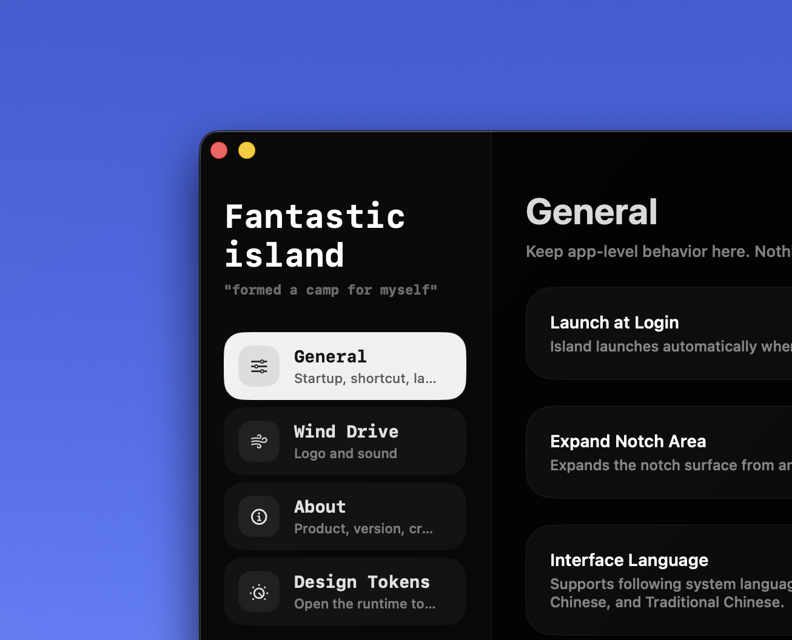
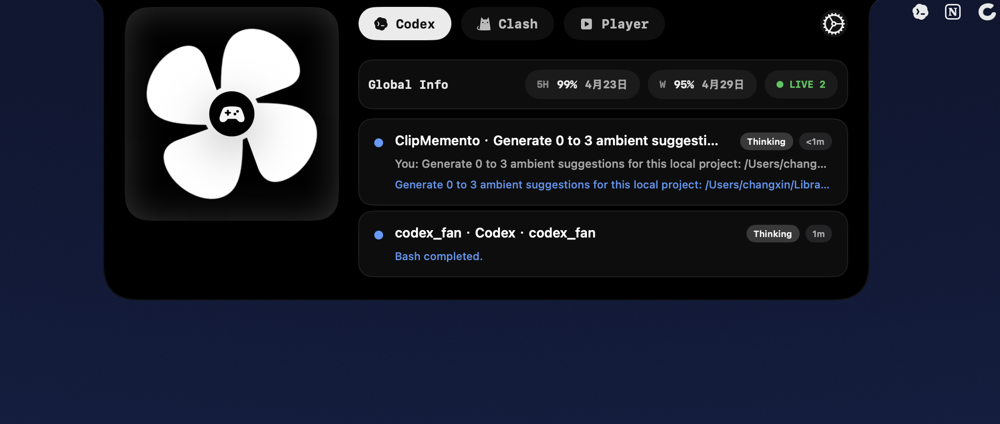
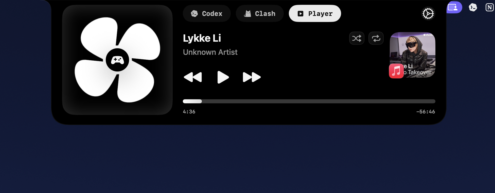

# Fantastic Island

[English](./README.md) | [简体中文](./README.zh-CN.md)

Fantastic island 基于开源项目 <vibe-open-island> 二次开发，是一个面向 macOS 刘海区域开放式的可扩展应用。

支持定制不能的能力以模组方式接入，代码同样开源，理论上，你可以基于这个容器及其扩展性，定制完全属于自己的岛

趣味性的风扇组件，纯粹是为了好玩，支持隐藏，当然也可以当成一个提醒器用

当前仓库已预置三个功能模组：

- `Codex`
- `Clash`
- `Player`

`Codex` 和 `Clash` 模组延续自开源基础继续演进

## 核心思路

越来越多围绕 island 区域来开发的产品，但 island 的区域是稀缺的，你用了 A 就不能用 B，不然交互上会有很大冲突
Fantastic island 源自开源项目 vibe-open-island，但真正想做的是基于壳架构和模组化扩展，让你可以按需定制属于自己的岛；比如你可以集成一个 todo 进来（虽然我不确定体验是否 ok）

## 设置与模组化

<p align="center">
  
</p>
<p align="center">
  
</p>

设置页把应用级行为、`Wind Drive`、模组开关和设计 token 调试入口放进了同一套界面。壳层保持稳定，模组层则可以继续扩展。

## 当前内置内容

| 模组 / 组件 | 说明 |
| --- | --- |
| `Codex` | 把本地 Codex 工作流状态收进岛面，包括 session、quota、approval、tool activity 和通知。 |
| `Clash` | 围绕 Mihomo / Clash 运行时提供接入与托管能力，并继续承载流量、代理组、规则、连接和日志等信息。 |
| `Player` | 读取当前播放状态，提供封面、进度和基础播放控制。 |
| `Wind Drive` | 岛中央的趣味风扇组件，可自定义 logo、音效和展示方式。 |

## 模组示例

### Codex

`Codex` 模组更像一个住在刘海里的本地工作台。会话状态、额度信息和最近活动都能直接看到，不需要频繁切回终端窗口。

`Claude` 暂时没有接进 agent 监控这条链路，是因为它把我号封了，当然我本身也更喜欢 Codex，so...



### Player

`Player` 模组用于展示和控制当前播放信息，让媒体控制和 `Codex`、`Clash` 共存，而不必再额外维护一层单独 UI。



### Clash

`Clash` 模组把代理运行时也纳入同一套交互模型：代理状态、流量、分组、规则、连接和日志都可以作为 island 的一等内容，而不是另一个分离面板。

## 仓库范围

这个仓库以 `source-only` 形式发布。

包含内容：

- 完整应用源码
- Xcode 工程
- 当前内置模组实现
- 许可证与第三方说明

不包含内容：

- DMG 打包产物
- 代码签名与 notarization 配置
- 个人开发团队标识
- 私有本地元数据
- 预打包的 Clash 运行时、面板或 geodata 资源

Clash 托管工作流在源码层面是开放的，但这个公开仓库不分发打包后的运行时资源。如果你要跑完整工作流，需要自行补充合规的运行时资产。

## 构建

本地构建：

```bash
xcodebuild -project 'FantasticIsland/FantasticIsland.xcodeproj' -scheme 'FantasticIsland' -configuration Debug CODE_SIGNING_ALLOWED=NO build
```

运行轻量逻辑测试：

```bash
swift test
```

## 上游与许可证

Fantastic Island 的刘海壳层交互部分继承并改编自 [open-vibe-island](https://github.com/Octane0411/open-vibe-island)。`Clash` 模组的源码侧集成面向 `mihomo` / `metacubexd` 生态，但当前仓库不分发它们的运行时发布产物。更多信息见 [LICENSE](./LICENSE) 和 [THIRD_PARTY_NOTICES.md](./THIRD_PARTY_NOTICES.md)。
